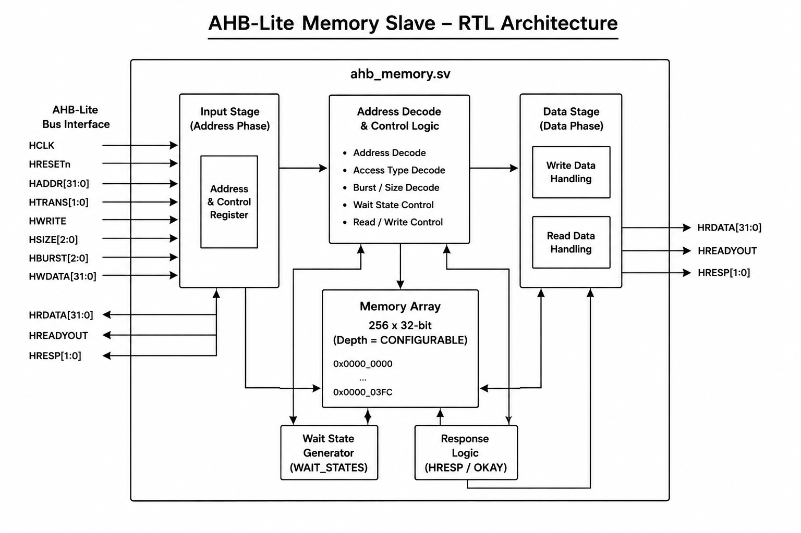
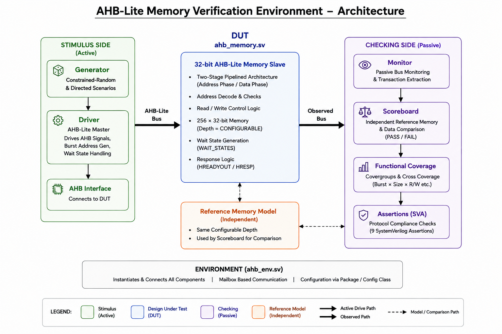
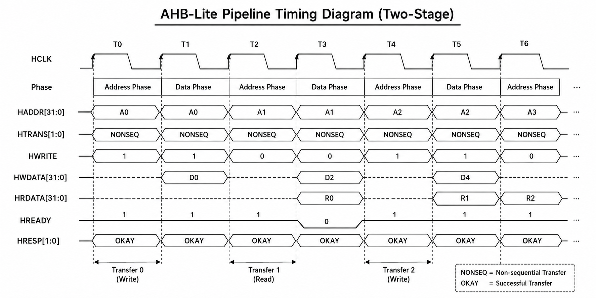
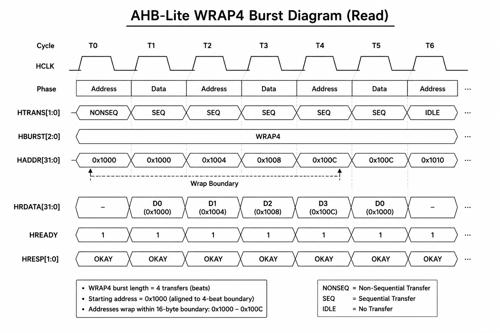
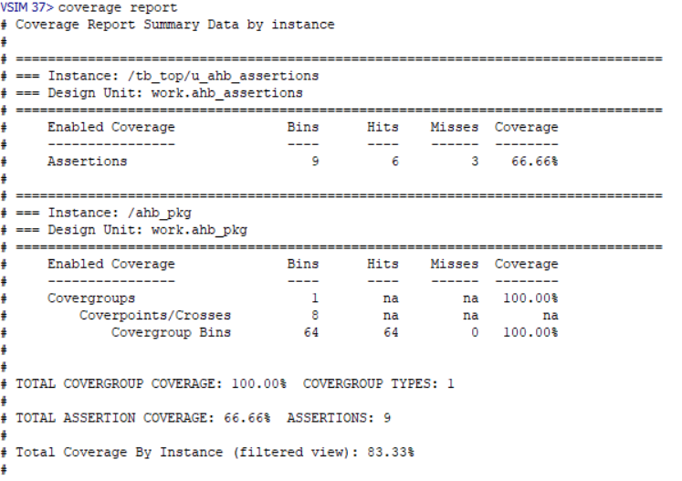

# 🔌 AMBA AHB-Lite Memory Verification using SystemVerilog

<p align="center">


</p>

<p align="center"><b>A complete, self-checking, constrained-random SystemVerilog verification environment</b><br>
built from scratch — no UVM — for a 32-bit AHB-Lite memory slave.</p>

---

## 📋 Table of Contents

- [Overview](#-overview)
- [Key Features](#-key-features)
- [Problem Addressed](#-problem-addressed)
- [System Architecture](#-system-architecture)
- [AHB Pipeline — Correctly Implemented](#-ahb-pipeline--correctly-implemented)
- [Burst Address Generation](#-burst-address-generation)
- [Core Testbench Components](#-core-testbench-components)
- [DUT: ahb_memory](#-dut-ahb_memory)
- [Test Scenarios](#-test-scenarios)
- [Simulation Results](#-simulation-results)
- [Functional Coverage](#-functional-coverage)
- [Assertions](#-assertions)
- [Project Structure](#-project-structure)
- [Design Parameters](#-design-parameters)
- [Example SystemVerilog Snippet](#-example-systemverilog-snippet)
- [How to Run](#-how-to-run-questa--modelsim)
- [Compilation Model](#-compilation-model)
- [Debugging Notes from Bring-Up](#-debugging-notes-from-bring-up)
- [Skills Demonstrated](#-skills-demonstrated)
- [Future Improvements](#-future-improvements)
- [Author](#-author)

---

## 🚀 Overview

This project implements a **self-checking, constrained-random SystemVerilog
verification environment** for a **32-bit AMBA AHB-Lite memory slave**,
without UVM. It is built to demonstrate the core skills a Design Verification
role actually requires — protocol-accurate stimulus generation, independent
checking, functional coverage, and assertion-based protocol compliance — in
code that a reviewer can read top-to-bottom in under 20 minutes.

<p align="center">

</p>

Unlike many beginner AHB testbenches, this one does **not** hard-code burst
addresses and does **not** treat AHB as a simple non-pipelined
request/response protocol. Both of those shortcuts are common enough that
getting them right is itself worth highlighting.

---

## 🎯 Key Features

✔ Full non-UVM SystemVerilog OOP testbench (classes, mailboxes, no UVM)
✔ All 8 AMBA AHB burst types: SINGLE, INCR, WRAP4, INCR4, WRAP8, INCR8, WRAP16, INCR16
✔ Byte / halfword / word transfer support
✔ Correctly pipelined address/data phases (beat N address phase overlaps beat N-1 data phase)
✔ General INCR/WRAP burst address algorithm — not hard-coded per burst type
✔ Configurable wait states (`WAIT_STATES` parameter)
✔ HRESP error handling for unaligned / out-of-range / unsupported-size accesses
✔ Self-checking scoreboard with an independent reference memory model
✔ Functional coverage: burst × size × read/write crosses
✔ 9 named SystemVerilog Assertions (SVA) for protocol compliance
✔ 17 directed + constrained-random test scenarios

---

## 🧠 Problem Addressed

The two most common mistakes in beginner AHB-Lite testbenches:

1. **Treating each transfer as a stand-alone request/response.** AHB is
   pipelined — the **address phase of beat N happens in the same clock cycle
   as the data phase of beat N-1.** A testbench that doesn't model this will
   pass simple SINGLE-transfer tests and then quietly break on every burst.
2. **Hard-coding burst addresses** (e.g. writing out `0x1000, 0x1004,
   0x1008, 0x100C` literally for a WRAP4 example) instead of implementing
   the general incrementing/wrapping address algorithm that works for any
   burst length, transfer size, and starting address.

This project solves both explicitly — see
[AHB Pipeline](#-ahb-pipeline--correctly-implemented) and
[Burst Address Generation](#-burst-address-generation) below.

---

## 🏗 System Architecture

<p align="center">

</p>

<!--
  INSERT YOUR OWN IMAGE HERE if you have a hand-drawn or tool-generated
  testbench block diagram in addition to the SVG above, e.g.:
  <p align="center"></p>
-->

The environment splits cleanly into a **stimulus side** (generator → driver,
which drives the DUT as the AHB master) and an **independent checking side**
(monitor → scoreboard / coverage / assertions), wired together by
`ahb_env.sv` using SystemVerilog mailboxes. The monitor is purely passive —
it never drives the DUT.

| Component | File | Role |
|---|---|---|
| Generator | `ahb_generator.sv` | Directed + constrained-random stimulus, guarantees all 8 burst types |
| Driver | `ahb_driver.sv` | Acts as the AHB master; drives every beat with correct pipelining |
| Monitor | `ahb_monitor.sv` | Passive bus observer; reconstructs beats |
| Scoreboard | `ahb_scoreboard.sv` | Independent reference memory; PASS/FAIL checking |
| Coverage | `ahb_coverage.sv` | Covergroups + crosses |
| Assertions | `ahb_assertions.sv` | 9 SVA protocol checks |
| Environment | `ahb_env.sv` | Wires everything together via mailboxes |

---

## 🔄 AHB Pipeline — Correctly Implemented

<p align="center">

</p>

<!--
  INSERT YOUR OWN IMAGE HERE: a Questa waveform screenshot showing
  back-to-back pipelined writes (HADDR/HWDATA/HTRANS overlapping across
  beats). Recommended caption below the image:
  "Waveform showing beat N's address phase (HADDR/HTRANS) issued in the
   same cycle as beat N-1's data phase (HWDATA) completing."
  <p align="center"></p>
-->

The driver (`ahb_driver.sv`) presents beat N's address **and** beat (N-1)'s
write data in the same clock edge. The DUT (`ahb_memory.sv`) latches the
address phase into a pipeline register exactly when the previous data phase
completes (`HREADYOUT` high). The monitor (`ahb_monitor.sv`) reconstructs
beats using the same pairing logic, so all three agree on what "one beat"
means — which is what makes the scoreboard's checking trustworthy.

---

## 🎲 Burst Address Generation

<p align="center">

</p>

Implemented once, generically, in `ahb_pkg.sv`, and reused by the driver for
every burst type — not hard-coded per case:

```systemverilog
// Incrementing bursts (INCR, INCR4, INCR8, INCR16)
next_address = current_address + transfer_bytes;

// Wrapping bursts (WRAP4, WRAP8, WRAP16)
wrap_boundary = burst_length * transfer_bytes;
base_address  = starting_address aligned down to wrap_boundary;
next_address  = current_address + transfer_bytes;
if (next_address reaches base_address + wrap_boundary)
    next_address = base_address;
```

Verified correct for every combination of
`{WRAP4, WRAP8, WRAP16} × {BYTE, HALFWORD, WORD}` — not just the textbook
0x1008 example shown above.

---

## ⚙ Core Testbench Components

### Transaction (`ahb_transaction.sv`)
Randomizable class: address, transfer size, burst type, read/write direction.
Constraints enforce legal alignment, in-range addressing, and valid burst
selection across all 8 types.

### Generator (`ahb_generator.sv`)
Produces directed transactions (used by TEST 2–15), a **guaranteed sweep**
of all 8 burst types (so coverage never depends on random luck alone), and
a configurable number of fully constrained-random transactions for the
stress test.

### Driver (`ahb_driver.sv`)
Acts as the AHB **master**. Expands each transaction into individual beats,
computes every beat's address via the general algorithm above, and drives
the pipeline correctly — including holding control signals stable during
wait states.

### Monitor (`ahb_monitor.sv`)
Fully **passive**. Reconstructs each beat (address phase + its paired data
phase) from the live bus and forwards it to the scoreboard and coverage
collector via mailbox. Never drives the DUT.

### Scoreboard (`ahb_scoreboard.sv`)
Maintains its own **independent reference memory model** — writes update it,
reads are checked against it, and every `HRESP` is checked against the
access's expected legality. Prints PASS/FAIL detail on any mismatch plus a
final Total/Passed/Failed summary.

### Coverage (`ahb_coverage.sv`)
Covergroups over `HBURST` (all 8 bins), `HSIZE`, `HWRITE`, `HRESP`, and
address range, with 3 useful crosses: burst × size, burst × read/write,
size × read/write.

### Assertions (`ahb_assertions.sv`)
9 named `assert property` checks — see [Assertions](#-assertions) below.

---

## 🧩 DUT: `ahb_memory`

32-bit AHB-Lite memory slave, 256 × 32-bit words (fully parameterizable).

<!--
  INSERT YOUR OWN IMAGE HERE if you have an RTL schematic / synthesis
  schematic view, e.g.:
  <p align="center"></p>
-->

| Feature | Behavior |
|---|---|
| Pipeline | Two-stage address/data phase register, latched on `HREADYOUT` |
| Burst addressing | **Not generated by the slave** — accepts whatever `HADDR` the master presents each beat |
| Access sizes | Byte, halfword, word |
| Error handling | `HRESP = ERROR` for unaligned, unsupported-size, or out-of-range accesses (write suppressed) |
| Wait states | Configurable via `WAIT_STATES` parameter (default 0) |
| Reset | Active-low, synchronous internal state clears |

> **Design note:** this DUT reports `HRESP = ERROR` as a single-cycle
> response (`HREADYOUT = 1` on the error cycle), rather than the two-cycle
> extended error response some real AHB slaves use. This is a deliberate
> simplification to keep the RTL and testbench easy to follow — the driver,
> monitor, and scoreboard are all written consistently with it.

---

## 🧪 Test Scenarios

| # | Scenario | # | Scenario |
|---|---|---|---|
| 1 | Reset behaviour | 10 | WRAP4 burst |
| 2 | Single Write | 11 | INCR8 burst |
| 3 | Single Read | 12 | WRAP8 burst |
| 4 | Byte Access | 13 | INCR16 burst |
| 5 | Halfword Access | 14 | WRAP16 burst |
| 6 | Word Access | 15 | Mixed Read/Write |
| 7 | SINGLE burst | 16 | Random Burst Test (all 8 types) |
| 8 | INCR burst | 17 | Stress Test (500 random transactions) |
| 9 | INCR4 burst | — | Directed error injection (out-of-range, misaligned) |

For a full per-test breakdown (objective, stimulus, expected result, pass
criteria), see [`TESTCASES.md`](TESTCASES.md). For the requirement-to-test
traceability table, see [`VERIFICATION_PLAN.md`](VERIFICATION_PLAN.md).

---

## 📊 Simulation Results

> Screenshots below are placeholders — replace with your own after running
> `run.do` (steps in [How to Run](#-how-to-run-questa--modelsim)).

**Console summary output:**

<p align="center">

</p>

```
========================================
AHB-LITE MEMORY VERIFICATION SUMMARY
========================================
Total Transactions : [INSERT]
Passed              : [INSERT]
Failed               : [INSERT]
Functional Coverage : [INSERT] %
========================================
TEST PASSED
========================================
```

**Waveform — WRAP4 burst (Questa wave viewer):**

<p align="center">

</p>

<!-- INSERT a second waveform image here for back-to-back pipelined writes
     if you'd like, e.g.:
     <p align="center"></p> -->

---

## 📈 Functional Coverage

<p align="center">

</p>

<!--
  INSERT YOUR OWN IMAGE HERE: assertion coverage screenshot from the HTML
  report (per-assertion hit/miss table), e.g.:
  <p align="center"></p>
-->

<details>
<summary><b>Coverpoints and crosses (click to expand)</b></summary>

| Coverpoint | Bins |
|---|---|
| `burst_cp` | single, incr, wrap4, incr4, wrap8, incr8, wrap16, incr16 |
| `size_cp` | byte_size, half_size, word_size |
| `rw_cp` | read_txn, write_txn |
| `response_cp` | okay_resp, error_resp |
| `address_cp` | low_range, mid_range, high_range, other |
| `burst_x_size` | cross of burst_cp × size_cp |
| `burst_x_rw` | cross of burst_cp × rw_cp |
| `size_x_rw` | cross of size_cp × rw_cp |

Generate the HTML report yourself:
```bash
vsim -coverage -voptargs="+acc" work.tb_top
# inside run.do, after `run -all`:
coverage save ahb_coverage.ucdb
# from a shell:
vcover report -html -output covhtml ahb_coverage.ucdb
```

</details>

---

## ✅ Assertions

| Assertion | Checks |
|---|---|
| `a_no_transfer_during_reset` | HTRANS is IDLE while HRESETn is low |
| `a_valid_htrans` | HTRANS is never X/Z |
| `a_aligned_word_access` | Word transfers have HADDR[1:0] == 00 |
| `a_aligned_halfword_access` | Halfword transfers have HADDR[0] == 0 |
| `a_seq_follows_active_burst` | SEQ only occurs after a NONSEQ opened a burst |
| `a_address_stable_when_waiting` | HADDR/HTRANS/HWRITE/HSIZE/HBURST stable during wait states |
| `a_valid_hresp` | HRESP is never X/Z |
| `a_hsel_gates_transfer` | No NONSEQ/SEQ while HSEL is low |
| `a_readyout_known` | HREADYOUT is never X/Z |

---

## 📁 Project Structure

<details>
<summary><b>Click to expand full file tree</b></summary>

```
ahb_project/
├── rtl/
│   └── ahb_memory.sv          DUT: AHB-Lite memory slave
├── tb/
│   ├── ahb_pkg.sv             Package: types, constants, address-math
│   │                          helpers, and (via `include) every TB class
│   ├── ahb_if.sv              AHB interface + clocking blocks + modports
│   ├── ahb_transaction.sv     [included] Randomizable transaction class
│   ├── ahb_generator.sv       [included] Directed + random stimulus generator
│   ├── ahb_driver.sv          [included] Drives the bus as the AHB master
│   ├── ahb_monitor.sv         [included] Passive bus monitor
│   ├── ahb_scoreboard.sv      [included] Reference memory + pass/fail checks
│   ├── ahb_coverage.sv        [included] Functional coverage (covergroups)
│   ├── ahb_env.sv             [included] Wires components via mailboxes
│   ├── ahb_assertions.sv      Standalone SVA protocol checker module
│   ├── ahb_test.sv            Directed test scenarios + random/stress test
│   └── tb_top.sv              Top-level: clock, reset, DUT, test instantiation
├── docs/images/                Architecture/timing diagrams + result screenshots
├── run.do                      Questa/ModelSim compile + simulate script
├── VERIFICATION_PLAN.md        Requirement-to-test traceability
├── TESTCASES.md                Per-test objective/stimulus/expected-result spec
├── LICENSE
└── README.md
```

</details>

---

## ⚡ Design Parameters

| Parameter | Location | Description | Default |
|---|---|---|---|
| `ADDR_WIDTH` | `ahb_pkg.sv` | Address bus width | 32 |
| `DATA_WIDTH` | `ahb_pkg.sv` | Data bus width | 32 |
| `MEM_DEPTH` | `ahb_pkg.sv` | Memory depth (32-bit words) | 256 |
| `WAIT_STATES` | `ahb_memory.sv` | Extra wait cycles per transfer | 0 |

---

## 💻 Example SystemVerilog Snippet

Driver logic that pipelines address phase (beat N) with data phase (beat N-1):

```systemverilog
for (int beat = 1; beat <= num_beats; beat++) begin
  // Data phase of the beat whose address phase just completed
  if (txn.write) vif.drv_cb.HWDATA <= txn.write_data[beat-1];

  // Address phase of the NEXT beat, driven in the same cycle
  if (beat < num_beats) begin
    vif.drv_cb.HADDR  <= beat_addr[beat];
    vif.drv_cb.HTRANS <= beat_trans[beat];
  end else begin
    vif.drv_cb.HTRANS <= HTRANS_IDLE;
  end

  @(vif.drv_cb);
  while (vif.drv_cb.HREADYOUT !== 1'b1) @(vif.drv_cb);
end
```

---

## ▶ How to Run (Questa / ModelSim)

```tcl
vsim -do run.do
```

or in batch mode from a shell:

```bash
vsim -c -do run.do
```

`run.do` compiles everything in the correct order, elaborates `tb_top`,
loads useful waves, runs to completion, and writes a text coverage report.

---

## 🧩 Compilation Model

<details>
<summary><b>Click to expand — why this project structures compilation the way it does</b></summary>

All testbench classes (`ahb_transaction`, `ahb_generator`, `ahb_driver`,
`ahb_monitor`, `ahb_scoreboard`, `ahb_coverage`, `ahb_env`) live in their own
files for readability, but are pulled into `ahb_pkg.sv` via `` `include ``
so they share one real package scope.

This matters because most simulators give each separate `vlog` invocation
its own compilation-unit scope — a bare `class` in file A is **not** visible
from file B just because A was compiled first. Putting everything inside a
package sidesteps that entirely.

**Do not run `vlog` directly on the included class files** — only these six
are real compilation units:

```
tb/ahb_if.sv          (standalone interface — no package dependency)
tb/ahb_pkg.sv          (pulls in every class via `include)
rtl/ahb_memory.sv      (standalone DUT)
tb/ahb_assertions.sv   (standalone SVA checker module)
tb/ahb_test.sv         (imports ahb_pkg)
tb/tb_top.sv           (top level)
```

`ahb_if.sv` intentionally does **not** import `ahb_pkg` — it takes
`ADDR_WIDTH`/`DATA_WIDTH` as its own parameters. This breaks what would
otherwise be a circular dependency (the package needs `ahb_if` declared
first, for the `virtual ahb_if.DRIVER`/`.MONITOR` types used by the driver
and monitor). `tb_top.sv` binds the interface's parameters to
`ahb_pkg::ADDR_WIDTH`/`DATA_WIDTH` explicitly so the two never drift apart.

</details>

---

## 🐛 Debugging Notes from Bring-Up

<details>
<summary><b>Click to expand — 4 real Questa errors hit and fixed during bring-up</b></summary>

These are real issues hit and fixed while bringing this project up in
Questa — kept here deliberately, since walking through them is good
interview material and shows the difference between code that merely
*looks* correct and code that has actually been compiled and simulated.

| Symptom | Root cause | Fix |
|---|---|---|
| `vlog-2730 Undefined variable: 'ahb_transaction'` | Bare classes in separate files aren't visible across separate `vlog` compilation units | Move all TB classes inside `ahb_pkg` via `` `include `` |
| `vopt-3843 Can't instantiate a module within an interface` | Used `bind ahb_if ahb_assertions ...` — binding a module into an *interface* isn't supported the way binding into a module is | Instantiate `ahb_assertions` as a plain module in `tb_top.sv` instead of `bind`-ing it into the interface |
| `vopt-7061 Variable 'mem' driven in an always_ff block, may not be driven by any other process` | `mem` was written both in the write `always_ff` and in a simulation-only `initial` block | Changed the write process to a plain `always @(posedge HCLK)` block |
| `vsim-3009 [TSCALE] module does not have a timeunit/timeprecision` | Only `tb_top.sv` had `` `timescale 1ns/1ps `` — `` `timescale `` doesn't carry across separately compiled files | Added `` `timescale 1ns/1ps `` as the first line of every file with a `module`/`interface`/`package` |

</details>

---

## 🛠 Skills Demonstrated

- SystemVerilog OOP testbench architecture (classes, mailboxes, no UVM)
- Constrained-random stimulus generation with meaningful constraints
- Self-checking scoreboard with an independent reference memory model
- Functional coverage (covergroups, coverpoints, cross coverage)
- SystemVerilog Assertions (SVA) for protocol compliance
- AMBA AHB-Lite protocol: pipelining, all 8 burst types, wait states, error responses
- Real Questa/ModelSim bring-up and debugging (see [Debugging Notes](#-debugging-notes-from-bring-up))

---

## 🔮 Future Improvements

- Multi-slave / address-decoder AHB interconnect
- Randomized wait-state injection per transaction (currently a static parameter)
- Protocol coverage on back-to-back same-address bursts and BUSY insertion
- Port to a lint-friendly open-source flow (Verilator/cocotb) for CI

---

## 👨‍💻 Author

Raviranjan Kumar

M.Tech VLSI Design and Embedded Systems
National Institute of Technology Kurukshetra

---

## ⭐ Support

If you find this project useful, please **⭐ star the repository**.
